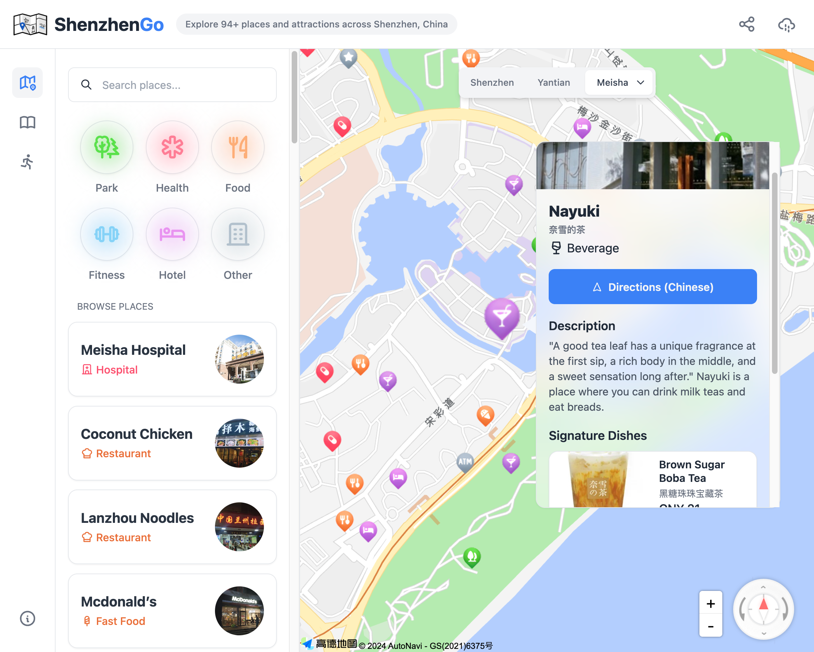
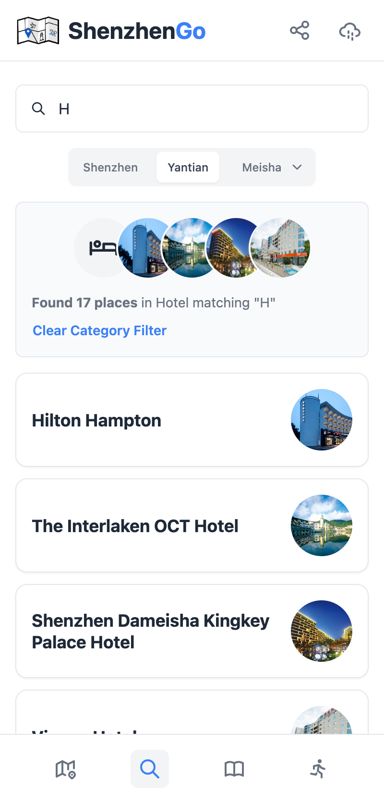
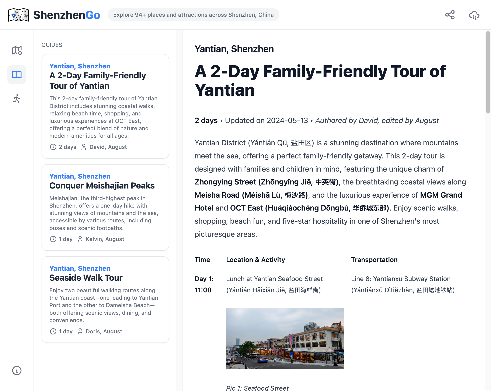
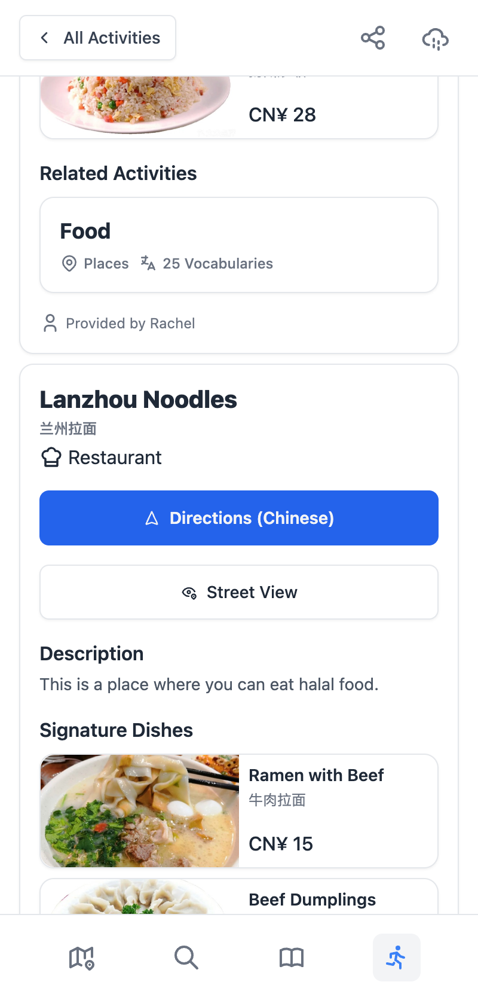
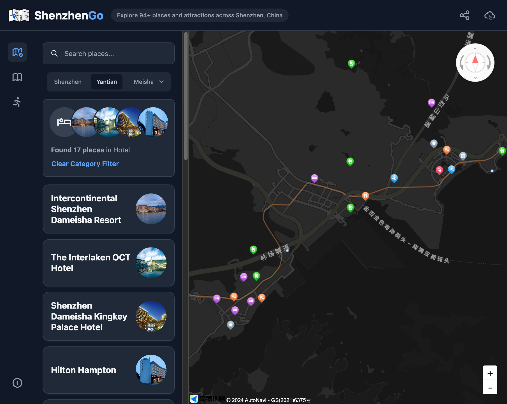
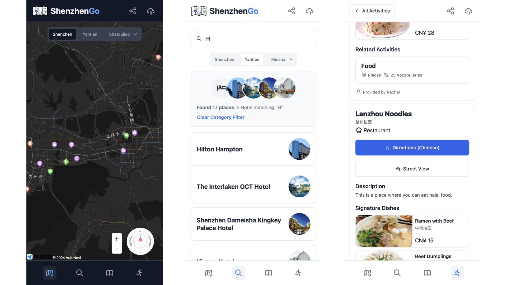

# ShenzhenGo

The first internationalized interactive map designed for a city in China, featuring rich points of interest information, searchable catalog, travel guides, and trip suggestions. Built to break down language barriers and make local tourism more accessible for foreigners.

[Visit the live app at shenzhengo.net](https://shenzhengo.net/?utm_source=github&utm_medium=readme&utm_campaign=readme)



[Features](#features) • [Development](#development) • [Contribution](#contribution) • [Data](#data) • [Deployment](#deployment) • [Roadmap](#roadmap) • [License](#license)

## Features

| **Interactive Map** | **Dynamic Regions** | **Directions and Street View** |
| --- | --- | --- |
| Explore Shenzhen through a user-friendly interactive map with clickable markers. These markers provide detailed information such as name, category, description, and recommendations for each place. | The map dynamically adjusts to display the most relevant places based on your current zoom level. Zoom into a specific area and the region tab will automatically switch to show that area. | Get directions to any place using your current location and view the street view with a single click. These options currently redirect to Chinese navigation apps (no need to input Chinese characters manually). |

| **Search and Filter** | **Guides** | **Activities** |
| --- | --- | --- |
|  |  |  |
| Search for places by name, category, or keywords and filter results based on activities or regions. | Access travel guides curated by local editors, detailing the best places to visit, eat, and shop in Shenzhen. | Choose from various activities like hiking, surfing, or sightseeing, and the app will show you the best locations for each. Additionally, learn basic Chinese vocabulary with our vocabulary cards. |



**Dark Mode**: ShenzhenGo adapts to your system's light or dark mode for a comfortable browsing experience.



**Mobile Friendly**: The app is optimized for all devices, including mobile phones and tablets.

## Development

To set up the project locally, follow these steps:

### Prerequisites

### Setup

Clone the repository and install dependencies:

```sh
git clone https://github.com/kapuic/shenzhengo.git
cd shenzhengo
bun install
```

### Environment Variables

Create a file named `.dev.vars` in the root of the project with the following content:

```sh
ENVIRONMENT=development

GROWTHBOOK_API_HOST="https://features-control.kapui.net" # Replace with your own hostname
GROWTHBOOK_CLIENT_KEY="" # Add your own key which should look like "sdk-iFs3N1jgRATLVc8"
GROWTHBOOK_DECRYPTION_KEY="" # Add your own key which should look like "eqQS5NaK49tkYHIGPQ+MAA=="

AMAP_API_KEY="" # Add your own key which should look like "862dd28d460675460adcda630bbd941c"
AMAP_API_VERSION = "2.0.5"
```

#### Explanation of Environment Variables

- **`GROWTHBOOK_API_HOST`**: The hostname for GrowthBook, a feature management and A/B testing platform. This variable points to your GrowthBook API server, which handles feature flags and experiments. Replace this with your own host to properly configure feature management.

- **`GROWTHBOOK_CLIENT_KEY`**: The SDK client key provided by GrowthBook. This key is essential for communicating with the GrowthBook API and fetching feature flags and experiments. Without this key, the app won't be able to access GrowthBook features, which may cause errors or result in missing functionality.

- **`GROWTHBOOK_DECRYPTION_KEY`**: The decryption key used for securely evaluating feature flags if you choose the Ciphered option for SDK Payload Security in GrowthBook. This key is required if you decide to use encrypted payloads. If you're using Remote Evaluation for feature flags, this key is not required and can be left empty. In such cases, make sure to configure your SDK for Remote Evaluation via GrowthBook's documentation.

  > The GrowthBook environment variables must be set up correctly for feature flags, A/B testing, and experiments. For setup, refer to [GrowthBook documentation](https://docs.growthbook.io). Misconfiguration or failure to provide these variables can cause the app to throw errors or disable some features. If you are not using GrowthBook or wish to remove feature flags, consider forking the repository and removing references to GrowthBook, including `GrowthBookProvider` and any usage of `useFeature` hooks.
  >
  > To configure your SDK for Remote Evaluation (which does not require the `GROWTHBOOK_DECRYPTION_KEY`), select the Remote Evaluated option in the SDK Payload Security settings in GrowthBook. If you choose to use the Ciphered option for SDK Payload Security, you must provide a valid decryption key. In this case, modify the `app/root.tsx` file by commenting out the `clientKey` or `decryptionKey`, depending on your security setup.

- **`AMAP_API_KEY`**: The API key for AMap, which is a Chinese map service provider. This key is required for accessing AMap's base layer data within the app. You must sign up for a developer account with AMap and generate your API key by following the instructions in their documentation: [AMap JavaScript API V2 Documentation](https://lbs.amap.com/api/javascript-api-v2/prerequisites).

  > AMap's base layer data includes minimal map data, such as streets, outlines of buildings, and other foundational geographic information. The project does not use other data, such as points of interest from AMap, as the objective is to create an internationalized map for foreign users by incorporating customized and tailored English data.

- **`AMAP_API_VERSION`**: Specifies the version of the AMap JavaScript API that the app is using. Currently, the project is set to version `2.0.5`, but this should be kept up-to-date with the latest stable release from AMap.

### Running the Development Server

Start the development server using Vite:

```sh
bun dev
```

You can now access the app at [http://127.0.0.1:8788](http://127.0.0.1:8788).

### Running Wrangler

To emulate the Cloudflare runtime:

```sh
bun run build
bun start
```

## Contribution

We welcome contributions from the community! Below are guidelines for adding places, categories, and activities, as well as general contribution guidelines.

### General Contribution Guidelines

1. **Fork** the repository.
2. **Create a new branch** for your feature or bug fix.
3. **Commit** your changes.
4. **Submit a pull request** for review.

### Formatting and Linting

We use Prettier for code formatting and ESLint for linting. To ensure your code follows the project's coding standards, use the following commands:

- **Formatting**: Run `bun format` to automatically format your code using Prettier.
- **Linting**: Run `bun lint` to check for and fix linting issues using ESLint.

If you are using Visual Studio Code, we recommend installing the Prettier and ESLint extensions for automatic formatting and linting in your editor.

## Data

### Places

A **place** represents a specific point of interest on the map, such as a park, restaurant, or landmark. Each place is identified by its geographical location (latitude and longitude) and is associated with a range (region) and category. Places contain additional details such as descriptions, images, street view links, and optionally signature dishes for restaurants. These properties provide a rich, informative experience for users exploring the city.

To add new places, modify the [`app/data/places.ts`](app/data/places.ts) file. Each place follows the `Place` interface from [`app/data/schema.ts`](app/data/schema.ts).

- **Required Fields**:

  - `location`: Latitude and longitude coordinates of the place.

    > `location` uniquely identifies a place and is required. It is a tuple of latitude and longitude. You can use the [AMap Coordinates Picker](https://lbs.amap.com/tools/picker) to obtain the coordinates for a place. Other tools may not work as expected since China uses a special coordinate system called GCJ-02, and AMap uses a variant of this system called BD-09. While conversion between these systems is possible, it is safer to use AMap's tools to get the coordinates directly.

  - `name`: Name of the place in English.
  - `originalName`: Original name of the place in Chinese.
  - `rangeId`: The ID of the range (region) where this place is located.
  - `categoryId`: The ID of the category this place belongs to (e.g., restaurant, beach).

- **Optional Fields**:

  - `description`: A brief description of the place.
  - `coverImage`: URL for a cover image.

    > Cover images are stored in the [`public/images`](public/images) directory. To add a new cover image, place it in the appropriate subdirectory `public/images/place-name/cover.jpg` and use the relative path `/images/place-name/cover.jpg` in the `coverImage` field.

  - `signatureDishes`: List of signature dishes if the place is a restaurant (include dish name, optional price, and image).

    > Similar to cover images, images for signature dishes are stored in the [public/images](public/images) directory. To add a new image, place it in the appropriate subdirectory `public/images/place-name/1.jpg`. These images are currently named in numeric order starting from 1. Use the relative path, such as `/images/place-name/1.jpg`, in the `image` field.

  - `streetViewUrl`: URL for the street view.

    > `streetViewUrl` enables the Street View feature for a place, showing a button that opens the Street View of the location. You can use [Baidu Maps](https://map.baidu.com)'s Street View feature to obtain the URL for a place. You may also use other providers, ideally those accessible in China. When adding a Baidu Street View URL, ensure to remove any unnecessary query parameters:
    >
    > - Replace `https://map.baidu.com/(.+)#` → `https://map.baidu.com/#`
    > - Delete `&tn=B_NORMAL_MAP&sc=0&newmap=1&shareurl=1`
    > - Delete `&ugc_type=3&ugc_ver=1&device_ratio=2&compat=1&pcevaname=pc4.1&querytype=detailConInfo&da_src=shareurl`
    > - Delete `&pid=([^&"]+)`
    > - Delete `,\d+z,\d+t,[\d.]+h`

  - `authors`: Author(s) who contributed this place (can be a string or an array of strings).

> **Example Entry**
>
> ```ts
> {
>   location: [114.308527, 22.596445],
>
>   name: "Nayuki",
>   originalName: "奈雪的茶",
>   rangeId: "meisha",
>   categoryId: "beverage",
>
>   description:
>     "This is a place where you can drink milk teas and eat breads.",
>   coverImage: "/images/nayuki/cover.jpeg",
>
>   signatureDishes: [
>     {
>       name: "Brown Sugar Boba Tea",
>       originalName: "黑糖珠珠宝藏茶",
>       price: 21,
>       image: "/images/nayuki/1.jpeg",
>     },
>     {
>       name: "Strawberry Creamed Bread",
>       originalName: "草莓魔法棒",
>       price: 20,
>       image: "/images/nayuki/2.jpeg",
>     },
>     {
>       name: "Grape Fruit Tea with Cheese",
>       originalName: "霸气芝士葡萄",
>       price: 28,
>       image: "/images/nayuki/3.jpeg",
>     },
>   ],
>
>   streetViewUrl:
>     "https://map.baidu.com/#panoid=2300570012221204205405903OI&panotype=street&heading=335.04&pitch=0&l=21&psp=%7B%22PanoModule%22%3A%7B%22markerUid%22%3A%221bd1f8675627201c081cc795%22%7D%7D",
>
>   authors: "Rachel",
> }
> ```

### Categories

A **category** groups places by type, such as restaurants, parks, or historical landmarks. It also provides visual elements like colors and icons for the map.

To add new categories, modify the [app/data/categories.ts](app/data/categories.ts) file. Each category follows the `Category` interface from [app/data/schema.ts](app/data/schema.ts).

- **Required Fields**:

  - `id`: A unique string identifier for the category.
  - `name`: The display name of the category.
  - `colors`: An object defining the color for the category, both for light and dark modes.

- **Optional Fields**:

  - `markerIcon`: An optional icon representing the category on the map. If not specified, it defaults to `"other"`.

    > Marker icons are stored in the [public/assets/markers](public/assets/markers) directory and the `public/assets/markers-(number)x` directories for different sizes. All icons are currently extracted from [public/assets/amap-markers.png](public/assets/amap-markers.png). Larger marker icons (e.g., `2x` and `4x`) are created using the open-source desktop version of [Upscayl](https://upscayl.org/). To add a new marker icon, place it in the appropriate subdirectory `public/assets/markers/(category-id).png`, and use the relative path `/assets/markers/(category-id).png` in the `markerIcon` field.

  - `parentId`: An optional string that links the category to a parent category.

#### Category Icons

Icons are an essential part of visualizing categories on the map. The available icons can be found at [Tabler Icons](https://tabler.io/icons). For each category, you need to import the corresponding icon from `@tabler/icons-react` and assign it to the category in the `categoryIcons` object.

##### Example of Adding an Icon

1. Visit [Tabler Icons](https://tabler.io/icons) and find an appropriate icon for your category.
2. Import the icon into the `categories.ts` file. For example, for a **restaurant** category:

   ```ts
   import { IconChefHat } from "@tabler/icons-react";
   ```

3. Add the icon to the `categoryIcons` object in the same file:

   ```ts
   export const categoryIcons: Record<string, ForwardRefExoticComponent<Omit<IconProps, "ref"> & RefAttributes<Icon>>> = {
     ...
     restaurant: IconChefHat,
     ...
   };
   ```

> **Example Entry**
>
> ```ts
> {
>   id: "apartment-rental",
>   name: "Apartment Rental",
>   colors: { light: "#B6C4D0", dark: "#7F92A1" },
>   markerIcon: "other",
>   parentId: "other",
> }
> ```
>
> ```ts
> import { IconTrees } from "@tabler/icons-react";
>
> export const categoryIcons: Record<string, ForwardRefExoticComponent<Omit<IconProps, "ref"> & RefAttributes<Icon>>> = {
>   ...
>   "apartment-rental": IconHomeSearch,
>   ...
> };
> ```

### Ranges

A **range** defines a geographical area, such as neighborhoods, districts, or regions of Shenzhen. Ranges help structure the map's display based on zoom levels and can also have a hierarchical structure.

To add new ranges, modify the [app/data/ranges.ts](app/data/ranges.ts) file. Each range follows the `Range` interface from [app/data/schema.ts](app/data/schema.ts).

- **Required Fields**:

  - `id`: A unique string identifier for the range.
  - `name`: The display name of the range.

- **Optional Fields**:

  - `description`: A brief description of the range.
  - `zoom`: The default zoom level (defaults to `15`).
  - `zooms`: A tuple of two numbers defining the minimum and maximum zoom levels at which the range is visible (defaults to `[11, 18]`).
  - `branding`: Custom branding options for the range, such as custom app names or icons.
  - `parentId`: An optional string that links the range to a parent range.
  - `showChildren`: A boolean that controls whether child ranges are shown by default (defaults to `false`).

> **Example Entry**
>
> ```ts
> {
>   id: "yantian",
>   name: "Yantian",
>
>   zoom: 13,
>   showChildren: true,
>
>   parentId: "shenzhen",
> }
> ```

### Activities

An **activity** represents a specific type of leisure or adventure tourists can engage in, such as hiking, surfing, or shopping. Activities can be linked to places, categories, and vocabulary cards to help visitors engage with the local culture.

To add new activities, modify the [app/data/activities.ts](app/data/activities.ts) file. Each activity follows the `Activity` interface from [app/data/schema.ts](app/data/schema.ts).

- **Required Fields**:

  - `id`: A unique string identifier for the activity.
  - `name`: The display name of the activity.

- **Optional Fields**:

  - `categoryIds`: An array of category IDs to which the activity belongs.
  - `placeLocations`: An array of coordinates linking specific places to the activity.
  - `vocab`: An array of vocabulary cards, where each entry contains the English word, its Chinese translation, and the pinyin (including tone marks) for pronunciation.

> **Example Entry**
>
> ```ts
> {
>   id: "hiking",
>   name: "Hiking",
>   placeLocations: [
>     [114.300844, 22.600616],
>     [114.312739, 22.59973],
>     [114.307954, 22.592429],
>   ],
>   categoryIds: ["walkway"],
>   vocab: [
>     { name: "Trail/Walk way", chinese: "栈道", pinyin: "Zhàndào" },
>     { name: "distance", chinese: "距离", pinyin: "Jùlí" },
>     { name: "Map", chinese: "地图", pinyin: "Dìtú" },
>     { name: "Compass", chinese: "指南针", pinyin: "Zhǐnánzhēn" },
>     { name: "Backpack", chinese: "背包", pinyin: "Bèibāo" },
>     { name: "Boots", chinese: "靴子", pinyin: "Xuēzi" },
>     {
>       name: "Trekking Poles",
>       chinese: "徒步行走杆",
>       pinyin: "Túbù xíngzǒu gǎn",
>     },
>     { name: "Camping", chinese: "露营", pinyin: "Lùyíng" },
>     { name: "Tent", chinese: "帐篷", pinyin: "Zhàngpéng" },
>     { name: "Wildlife", chinese: "野生动物", pinyin: "Yěshēng dòngwù" },
>     { name: "Elevation", chinese: "海拔", pinyin: "Hǎibá" },
>     { name: "Summit", chinese: "山顶", pinyin: "Shāndǐng" },
>     { name: "Landscape", chinese: "风景", pinyin: "Fēngjǐng" },
>     { name: "Terrain", chinese: "地形", pinyin: "Dìxíng" },
>     {
>       name: "Rain Gear",
>       chinese: "防雨装备",
>       pinyin: "Fángyǔ zhuāngbèi",
>     },
>     { name: "First Aid Kit", chinese: "急救包", pinyin: "Jíjiù bāo" },
>     {
>       name: "Hydration",
>       chinese: "水分补充",
>       pinyin: "Shuǐfèn bǔchōng",
>     },
>     { name: "Snacks", chinese: "小吃", pinyin: "Xiǎochī" },
>     { name: "Navigation", chinese: "导航", pinyin: "Dǎoháng" },
>     { name: "Sunscreen", chinese: "防晒霜", pinyin: "Fángshài shuāng" },
>     { name: "Bug Spray", chinese: "驱虫喷雾", pinyin: "Qūchóng pēnwù" },
>     { name: "Weather", chinese: "天气", pinyin: "Tiānqì" },
>   ],
> }
> ```

## Deployment

Before deploying the app, ensure that all environment variables are properly set. Please refer to the [Environment Variables](#environment-variables) section for details on configuring the necessary keys. For deployment, make sure to set `ENVIRONMENT=production` and use the appropriate GrowthBook SDK credentials specific to your production environment.

To build and deploy the app, follow these steps:

1. Build the project for production:

   ```sh
   bun run build
   ```

2. Deploy the project:

   ```sh
   bun deploy
   ```

Alternatively, you can deploy the app using the Cloudflare dashboard. This method allows for a more user-friendly deployment experience directly through Cloudflare's interface. To learn more about deploying your app through the Cloudflare Pages dashboard, refer to the official documentation: [Cloudflare Pages Framework Guide for Remix](https://developers.cloudflare.com/pages/framework-guides/deploy-a-remix-site/#before-you-continue).

## Roadmap

We plan to add the following features in future versions:

- Multi-language support (beyond English and Chinese).
- Offline map support for travelers without reliable internet access.
- User-generated reviews and ratings for places.

## License

This project is [fair-code](https://faircode.io/) licensed under the [Sustainable Use License](LICENSE.md).

All data and written content, including this README, is licensed under the [Creative Commons Attribution-NonCommercial-ShareAlike 4.0 International License](https://creativecommons.org/licenses/by-nc-sa/4.0/).
